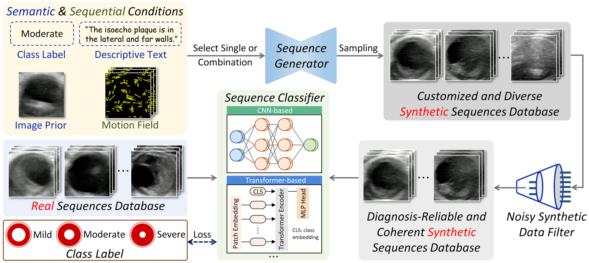
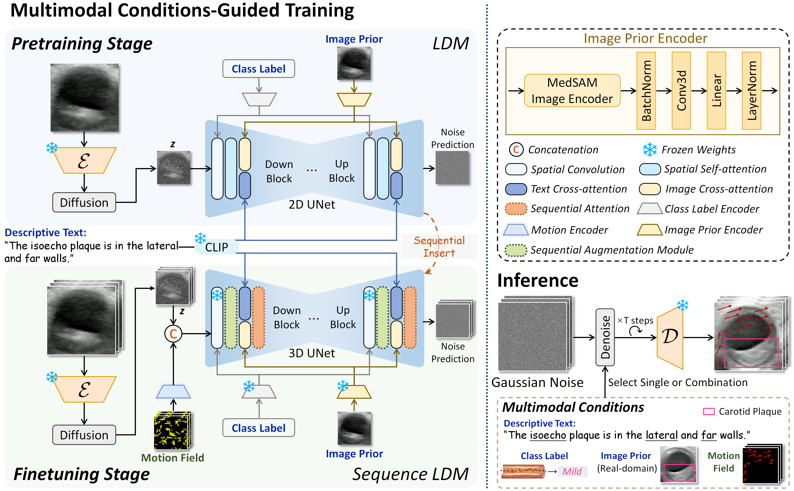

# Ctrl-GenAug
This codebase provides the official PyTorch implementation for Ctrl-GenAug: Controllable Generative Augmentation for Medical Sequence Classification (accepted by IJCV 2026).

[](https://arxiv.org/pdf/2409.17091)

## 📖 Introduction
In this work, we present *Ctrl-GenAug*, a novel and general generative augmentation framework that enables highly semantic- and sequential-customized sequence synthesis and suppresses incorrectly synthesized samples, to aid **medical sequence classification**. Specifically, we first design a **multimodal conditions-guided sequence generator** for controllably synthesizing diagnosis-promotive samples. A sequential augmentation module is integrated to enhance the temporal/stereoscopic coherence of generated samples. Then, we propose a **noisy synthetic data filter** to suppress unreliable cases at the semantic and sequential levels. Extensive experiments on 5 medical datasets with 4 different modalities, including comparisons with 15 augmentation methods and evaluations using 11 networks trained on 3 paradigms, comprehensively demonstrate the effectiveness and generality of *Ctrl-GenAug*, particularly with pronounced performance gains in underrepresented high-risk populations and out-domain conditions.

## :mega: Overall Framework
#### Pipeline of using our *Ctrl-GenAug* to facilitate medical sequence recognition, which can be worked with a variety of classifiers:

<p align="center">
  
</p>

## 💫 Sequence Generator
#### Our generator produces a real-domain style sequence that faithfully adheres to all specified conditions.

<p align="center">
  
</p>

## 👀 Model Zoo

To support research in medical sequence analysis, we provide checkpoints of our sequence generator trained on four public datasets.

| **Dataset** | **FVD** | **VAE-Seq** | **Dynamic Smoothness** | **Download** |
|:-----------:|:-------:|:-----------:|:-----------------------:|:------------:|
| [MosMedData](https://www.kaggle.com/datasets/mathurinache/mosmeddata-chest-ct-scans-with-covid19) | 2.91 | 84.07% | 96.33% | [ckpt](https://hkustconnect-my.sharepoint.com/:u:/g/personal/xzhoucv_connect_ust_hk/IQBAnJhJQzSST7P2t_vbCYL-AfmwZVNSujgEeTSK_rTbrew?e=V0hh67) |
| [MRNet](https://stanfordmlgroup.github.io/competitions/mrnet/) | 8.14 | 77.10% | 93.81% | [ckpt](https://hkustconnect-my.sharepoint.com/:u:/g/personal/xzhoucv_connect_ust_hk/IQAGa4kvpmFMRZ-IzuhiXannAasaKA5K2h2n6FmVUVkxGts?e=7f5KMH) |
| [ACDC](https://www.creatis.insa-lyon.fr/Challenge/acdc/) | 8.18 | 77.08% | 92.77% | [ckpt](https://hkustconnect-my.sharepoint.com/:u:/g/personal/xzhoucv_connect_ust_hk/IQAHnyJD9eJCRoMuy81IIyfdAUn9ddhuZ5quIxLeusx2RME?e=0QuERa) |
| [TUSC](https://stanfordaimi.azurewebsites.net/datasets/a72f2b02-7b53-4c5d-963c-d7253220bfd5) | 3.69 | 92.14% | 95.59% | [ckpt](https://hkustconnect-my.sharepoint.com/:u:/g/personal/xzhoucv_connect_ust_hk/IQBmXuCS7F74TZLB_dyGOS5YAYJbN3NJnaaPgEgXWNATpvk?e=ZAOK21) |

The extensive downstream classification improvements achieved with *Ctrl-GenAug* are presented in our paper.

## Diagnosis-promotive Synthetic Datasets

To support research in medical sequence analysis, we release the synthetic databases generated by *Ctrl-GenAug*. We hope these resources could serve as a valuable supplement for model development.

- [Download MosMedData-Synthetic (Lung, CT)](https://hkustconnect-my.sharepoint.com/:u:/g/personal/xzhoucv_connect_ust_hk/IQCh5xuYEvc2Qp0MKGCNvY9gAQBxh5XfFKbtjJsV2Ioet2o?e=d3r1uP)
- [Download MRNet-Synthetic (Knee, T2-weighted MRI)](https://hkustconnect-my.sharepoint.com/:u:/g/personal/xzhoucv_connect_ust_hk/IQB9bGIrRc3STL33Fn5O6NiZAf5YE5bXLebibG1A_BU1QYo?e=nuHeGw)
- [Download ACDC-Synthetic (Heart, Cine-MRI)](https://hkustconnect-my.sharepoint.com/:u:/g/personal/xzhoucv_connect_ust_hk/IQCLXd3SoF65SqtgYX7cYqCIAfDGrEn1ExZTTo9hVONMv_o?e=jbKdOw)
- [Download TUSC-Synthetic (Thyroid, Ultrasound)](https://hkustconnect-my.sharepoint.com/:u:/g/personal/xzhoucv_connect_ust_hk/IQCmeFizQ-dJS7fthEr7jXHcAZz2AIEKZMQGnzcwVXJAFss?e=tPLb0w)
- [Download Carotid-Synthetic (Carotid artery, Ultrasound)](https://hkustconnect-my.sharepoint.com/:u:/g/personal/xzhoucv_connect_ust_hk/IQAhXmrsTIiKRqbsc_NAJc8eASEqrOgJVjW2658vyY856Fw?e=qjs8u5)

## 🕹️ Preparations

### 1. Installation

Requirements:
- Python==3.8.13
- torch==1.12.1+cu116
- torchvision==0.13.1+cu116
- diffusers==0.11.1
- transformers==4.34.1
- tokenizers==0.14.1
- ffmpeg
- motion-vector-extractor==1.0.6

You can also create an identical environment to ours using the following command:
```
cd ./Ctrl-GenAug
conda env create -f environment.yml
```

### 2. Download the Public Real Datasets

- [MosMedData](https://www.kaggle.com/datasets/mathurinache/mosmeddata-chest-ct-scans-with-covid19)
- [MRNet](https://stanfordmlgroup.github.io/competitions/mrnet/)
- [ACDC](https://www.creatis.insa-lyon.fr/Challenge/acdc/)
- [TUSC](https://stanfordaimi.azurewebsites.net/datasets/a72f2b02-7b53-4c5d-963c-d7253220bfd5)

### 3. Pre-process the Real Datasets

We provide the preprocessing scripts along with our dataset split information. Please follow the steps below.

#### Step (a) Extract all slices/frames and save their metadata, including file names, texts (TUSC only), and labels:

```bash
# For MosMedData
python MosMedData/extract_all_slices.py

# For MRNet
python MRNet/extract_all_slices.py

# For ACDC
python ACDC/extract_all_slices.py

# For TUSC
python TUSC/extract_all_images.py
python TUSC/save_all_consecutive_images.py   # Delete non-consecutive frames in the original dataset
python TUSC/extract_all_texts.py   # Generate texts
```

#### Step (b) Perform uniform sampling based on the data extracted in step (a)

```bash
# For MosMedData
python MosMedData/sample_sequences.py \   
    --all_slices_dir MosMedData/MosMed_all_slices \   # Directory containing all slices extracted in step (a)
    --mode <> \                                       # Train / test only
    --frames_per_clip 15 \                            # See the script for detailed parameter descriptions
    --clip_sampling_interval 1 \                      # See the script for detailed parameter descriptions
    --required_clip_num 8

# For MRNet
python MRNet/sample_sequences.py \
    --all_slices_dir MRNet/MRNet_all_slices \
    --mode <> \
    --frames_per_clip 15 \
    --clip_sampling_interval 1 \
    --required_clip_num 8

# For ACDC
python ACDC/sample_sequences.py \
    --all_slices_dir ACDC/ACDC_all_slices \
    --mode <> \
    --frames_per_clip 8 \
    --clip_sampling_interval 0 \
    --required_clip_num 8

# For TUSC
python TUSC/sample_videos.py \
    --all_frames_dir TUSC/TUSC_all_images_consecutive \
    --mode <> \
    --frames_per_clip 15 \
    --clip_sampling_interval 1 \
    --required_clip_num 8 \
```

**Note:**

After completing step (b),
- You can obtain the sampled frames/slices (e.g., ``MosMedData/MosMed_data``) and corresponding metadata for training our VAE and sequence generator (**Pretraining Stage**).
- You can accordingly obtain the sampled clips (e.g., ``MosMedData/MosMed_volume``) and corresponding metadata for training our sequence generator (**Finetuning Stage**).
- You may delete the folder ``<dataset>_all_slices`` (or the folders ``TUSC_all_images`` and ``TUSC_all_images_consecutive`` for TUSC only), which is no longer needed, to free storage space.

We have also provided metadata files based on our dataset split for your reference. Taking *MosMedData* as an example:

```
# Slice-level metadata for LDM pretraining
MosMedData/MosMed_data/train_metadata.jsonl
MosMedData/MosMed_data/test_metadata.jsonl

# Clip-level metadata for Sequence LDM finetuning
MosMedData/MosMed_volume/train_metadata.jsonl
MosMedData/MosMed_volume/test_metadata.jsonl
```

#### Step (c) Generate domain-specific image prior features

We extract image prior features for each training frame/slice (e.g., training images in ``MosMedData/MosMed_data``) using the [MedSAM](https://github.com/bowang-lab/MedSAM) image encoder ([base](https://drive.google.com/drive/folders/1ETWmi4AiniJeWOt6HAsYgTjYv_fkgzoN) model). Please refer to their instructions.
The resulting image priors for *MosMedData* should be saved in the following form; the same applies to other datasets.

```
Ctrl-GenAug
└── MosMedData
    └── MosMed_data_emb
        ├── study_0001_slice01.npy
        ├── study_0001_slice03.npy
        ├── study_0001_slice05.npy
        └── ...
```

#### Step (d) Produce motion fields and sample motion field-based trajectories

```bash
python extract_motion_field_trajs.py --clip_data_dir <>   # Directory containing the pre-processed clips from step (b)
```

#### Step (e) Arrange all pre-processed data into the following structure to prepare for sequence generator training

```
Ctrl-GenAug
├── MosMedData
│   ├── MosMed_data
│   │   ├── study_0001_slice01.png
│   │   ├── study_0001_slice03.png
│   │   └── ...
│   ├── MosMed_data_emb
│   │   ├── study_0001_slice01.npy
│   │   ├── study_0001_slice03.npy
│   │   └── ...
│   ├── MosMed_volume
│   │   ├── study_0001_s01.avi
│   │   ├── study_0001_s29.avi
│   │   └── ...
│   ├── MosMed_motion_field
│   │   ├── study_0001_s01.npy
│   │   ├── study_0001_s29.npy
│   │   └── ...
│   └── MosMed_motion_field_trajectory
│       ├── study_0001_s01.npy
│       ├── study_0001_s29.npy
│       └── ...
├── MRNet
│   └── ...
├── ACDC
│   └── ...
└── TUSC
    └── ...
```

🥳 After completing the preparations, you can proceed to build the *Ctrl-GenAug* framework.

## 🔥 Step 1: Sequence Generator Training

#### 1. VAE model

Before training the VAE, 
- Please replace the original VAE version in the diffusers package (``./envs/videodiff/lib/python3.8/site-packages/diffusers/models/vae.py``) with the script provided in this repo (``cond2img/models/vae.py``)
  to ensure compatibility with our pipeline.
- Please download the official VAE [checkpoint](https://huggingface.co/CompVis/stable-diffusion-v1-4/tree/main/vae) (``diffusion_pytorch_model.bin``) and place it in ``configs/compress_ratio_8_vae_config/vae/``.

```bash
sh vae_train.sh   # we use 4 A6000 gpus by default
```

#### 2. Pretraining Stage: Multimodal Conditions-Guided Latent Diffusion Model (LDM)

Before training the proposed LDM, 
- Please download the official text encoder [checkpoint](https://huggingface.co/CompVis/stable-diffusion-v1-4/tree/main/text_encoder) (``model.safetensors``) and place it in ``configs/compress_ratio_8_sd_config/text_encoder/``.
- Please place your customized trained VAE (including ``config.json`` and ``diffusion_pytorch_model.bin``) in ``configs/compress_ratio_8_sd_config/``, and name the folder ``[your-data]-vae-pretrained``.
- Please download the official unet [checkpoint](https://huggingface.co/CompVis/stable-diffusion-v1-4/tree/main/unet) (``diffusion_pytorch_model.safetensors``) and place it in ``configs/compress_ratio_8_sd_config/unet/``.
- Modify the parameter ``num_class_embeds`` in ``configs/compress_ratio_8_sd_config/unet/config.json`` according to the number of classes in your dataset.

```bash
sh LDM_train.sh   # we use 4 A6000 gpus by default
```

#### 3. Finetuning Stage: Multimodal Conditions-Guided Sequence LDM

Before training the proposed Sequence LDM, 
- Please ensure that you have completed the pretraining stage and prepared your scheduler, tokenizer, text encoder, VAE, and LDM-UNet in a single folder that follows the structure below:
```
pretrained_2d_model_[your-data]
├── [your-data]-vae-pretrained
│   ├── config.json
│   └── diffusion_pytorch_model.bin
├── scheduler
│   └── scheduler_config.json
├── text_encoder
│   ├── config.json
│   └── model.safetensors
├── tokenizer
│   ├── merges.txt
│   ├── special_tokens_map.json
│   ├── tokenizer_config.json
│   └── vocab.json
└── unet
    ├── config.json
    └── diffusion_pytorch_model.bin   # your trained LDM-UNet
```
This folder's path corresponds to the parameter ``pretrained_2d_model_path`` in the Sequence LDM configuration ``sequence_LDM_config`` used in ``sequence_LDM_train.sh``.

- Please add the three lines below to your trained LDM-UNet configuration file ``pretrained_2d_model_[your-data]/unet/config.json``:
```
"self_attn_mode": "SAM",   # our sequential augmentation module
"insert_strategy": "concat",   # concat the latent features with motion fields
"motion_condition": true
```

```bash
sh sequence_LDM_train.sh   # we use 4 A6000 gpus by default
```

## 🚀 Step 2: Generate Synthetic Sequences

Using conditions derived from real sequences, we can obtain large-scale synthetic databases.

```bash
python generate.py \
    --load_2d_pretrained_model_name <> \                                  # Your pretrained LDM
    --load_3d_trained_model_name <> \                                     # Your finetuned sequence LDM
    --user_defined_conditions ["image_condition", "motion_condition"] \   # Class label is always used
    --predifined_sampled_num <> \                                         # The number of synthetic data per class
    --batch_size 1 \
    --num_workers 3 \
    --device_id_list [0,1,2]
```

**Note:**

- We support batch generation by ``num_workers`` parallel worker processes. Each worker process uses one GPU and is responsible for processing a designated set of batches (``batch_size``).
- [IMPORTANT] If the sequence generator and the downstream model are trained on the same custom dataset, you should use conditions from the real **training** sequences (rather than the testing ones) to generate synthetic data for downstream tasks.
  This is necessary to avoid data leakage.

## ⏳ Step 3: Filter Out Noisy Synthetic Cases

Before filtering, 
- You should first train a video classifier in the real-data domain under the *Baseline* paradigm. You may use [MMAction2](https://github.com/open-mmlab/mmaction2) for this step.
- Then, you need to calculate the VAE-Seq values for the entire synthetic database (see our paper for details) using the following command:

```bash
python VAE-Seq.py \
    --load_2d_pretrained_model_name <> \   # Your pretrained LDM
    --syn_data_p <> \                      # Your synthetic database path
```

Next, run the following command to perform filtering:

```bash
python noisy_data_filter.py \
    --syn_data_p <> \                      # Your synthetic database path
    --cls_model_name <> \                  # Classifier employed for semantic filtering
    --cls_model_pth <> \                   # Checkpoint of the classifier used for semantic filtering
    --load_2d_pretrained_model_name <> \   # Your pretrained LDM
    --save_base <>                         # Path of the final synthetic databases
    
```

**Note:**
We use classifiers from the MMAction2 framework in the script to perform semantic filtering. Please set up the [MMAction2](https://github.com/open-mmlab/mmaction2) environment to enable execution.

## :black_nib: Citation

If you find our repo useful for your research, please consider citing our paper:
```bibtex
@article{zhou2024ctrl,
  title={Ctrl-GenAug: Controllable generative augmentation for medical sequence classification},
  author={Zhou, Xinrui and Huang, Yuhao and Dou, Haoran and Chen, Shijing and Chang, Ao and Liu, Jia and Long, Weiran and Zheng, Jian and Xu, Erjiao and Ren, Jie and others},
  journal={arXiv preprint arXiv:2409.17091},
  year={2024}
}
```

## 🤝 Acknowledgement

We sincerely appreciate the code release of the following projects: [diffusers](https://github.com/huggingface/diffusers), [videocomposer](https://github.com/ali-vilab/videocomposer), and [mmaction2](https://github.com/open-mmlab/mmaction2).
